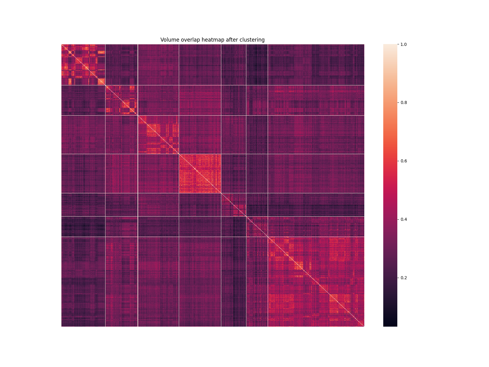
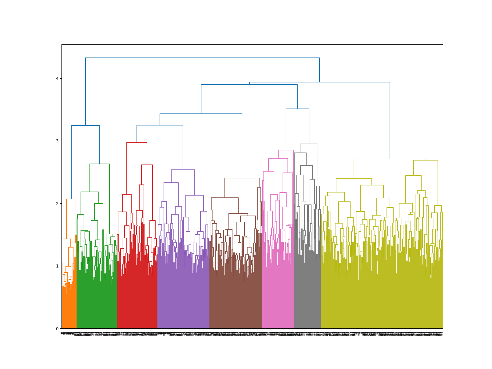
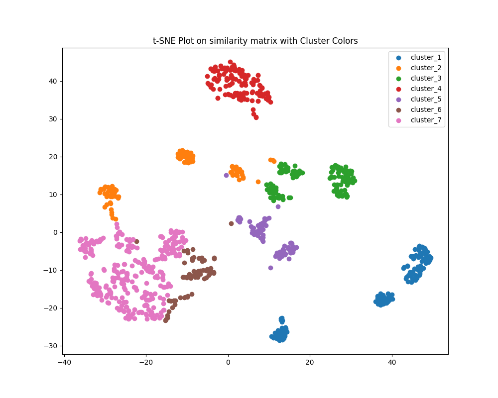

# Molecular dynamics, clustering of ECL2 strutures

This project contains the code to create a clustering of multiple different md frames. In our case we used it to
compare the structures of the extracellular loop 2 (**ECL2**) in GPCRs. I have implemented 4 different methods to compute the similarity 
between 2 structures.

| Method name                            | Dependencies                   | How does it work                                                                                         | Required inputs                                                   |
|----------------------------------------|--------------------------------|----------------------------------------------------------------------------------------------------------|-------------------------------------------------------------------|
| Schrödinger phase_vol_calc             | A valid Schrödinger licence    | using the Schrödinger utility phase_vol_cal to calculate the volume overlap between 2 structures         | A maestro file (.mae) with all frames   (--md_frames)          |
| GOGO Go annotation similarity          | A folder with the GOGO scripts | Extracts the GO annotations from each whole GPCR and uses the MFO similarity computed by GOGO to cluster | A folder with pdb files (only one frame for each protein is used) |
| TM-aglin similarity                    | A compiled TM-align executable | Using tm-align, the tm score for 2 peptide chains is computed                                            | A folder with pdb files (--pdb_files)                             |
| Vmd CCC (cross croelation coefficient) | A vmd installation             | Calculates the cross corelation coefficient between 2 atomic density maps                                | A folder with pdb files (--pdb_files)                             |

Regardless of the similarity measure used, the clustering of the structures always uses scipys linkage hierarchical clustering.
An example output would look like this. (using the VMD CCC method)

# References

Yang Zhang and Jeffrey Skolnick. “TM-align: a protein structure alignment algorithm based on the TM-score”.
In: Nucleic Acids Res. 33.7 (Apr. 2005), pp. 2302–2309. issn: 0305-1048. doi: 10.1093/nar/gki524.   
Chenguang Zhao and Zheng Wang. “GOGO: An improved algorithm to measure the semantic similarity between
gene ontology terms”. In: Sci. Rep. 8.15107 (Oct. 2018), pp. 1–10. issn: 2045-2322. doi: 10.1038/s41598-018-
33219-y.